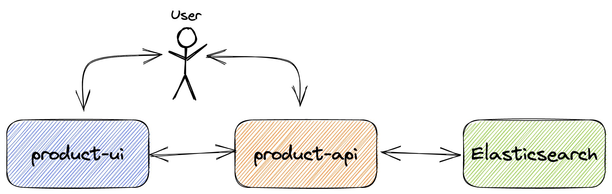

= springboot-elasticsearch-thymeleaf

The goal of this project is to implement an application called `product-app`. It consists of two https://docs.spring.io/spring-boot/index.html[`Spring Boot`] services: `product-api` (backend) and `product-ui` (frontend). The data will be stored in https://www.elastic.co/elasticsearch[`Elasticsearch`].

== Proof-of-Concepts & Articles

On https://ivangfr.github.io[ivangfr.github.io], I have compiled my Proof-of-Concepts (PoCs) and articles. You can easily search for the technology you are interested in by using the filter. Who knows, perhaps I have already implemented a PoC or written an article about what you are looking for.

== Project diagram

== Applications

* **product-api**
+
`Spring Boot` Web Java application that exposes a REST API to manage products. Product information is stored in `Elasticsearch`. `product-api` uses https://docs.spring.io/spring-data/elasticsearch/reference/[`Spring Data Elasticsearch`] to persist/query/delete data in `Elasticsearch`.

* **product-ui**
+
`Spring Boot` Web application that was implemented using https://www.thymeleaf.org/[`Thymeleaf`] as HTML template. Also, it uses https://docs.spring.io/spring-framework/reference/integration/rest-clients.html#rest-http-interface[`Http Interfaces`] to simplify HTTP remote access to `product-api`.

== Prerequisites

* https://www.oracle.com/java/technologies/downloads/#java21[`Java 21`] or higher;
* A containerization tool (e.g., https://www.docker.com[`Docker`], https://podman.io[`Podman`], etc.)

== Start Environment

* Open a terminal and navigate to the `springboot-elasticsearch-thymeleaf` root folder run:
+
[,bash]
----
docker compose up -d
----

* Wait for `Elasticsearch` Docker container to be up and running. To verify it, run:
+
[,bash]
----
docker ps -a
----

== Initialize Elasticsearch

NOTE: In the following steps, we will create an index, an alias and do a reindex using pre-defined scripts. In case you prefer to do it step-by-step calling `Elasticsearch` API, refer to link:create-index-alias-reindex.adoc[Creating indexes, alias and reindexing using Elasticsearch API].

* In a terminal, make sure you are in the `springboot-elasticsearch-thymeleaf` root folder;

* Run the following script to create the index `ecommerce.products.v1` with the alias `ecommerce.products` (you can use the default values by just pressing `Enter` on every user input):
+
[,bash]
----
./create-index.sh
----

* If you want to insert some products, run:
+
[,bash]
----
./insert-products.sh
----

* If you want to fix the `reference` property mapping error (explained below), run:
+
[,bash]
----
./reindex.sh
----
+
The script `./reindex.sh` is used to reindex one index to another. The default will reindex from `ecommerce.products.v1` to `ecommerce.products.v2`. The only difference between `elasticsearch/mapping-v1.json` (used by `ecommerce.products.v1`) and `elasticsearch/mapping-v2.json` (used by `ecommerce.products.v2`) is the `type` of the `reference` property. In the former, it is set the type `text` and, in the latter, the type `keyword`.
+
It's interesting because the `reference` property has some special characters. An example of `reference` code is `SBES@DDR4-10000`. As it has the type `text`, `Elasticsearch` (using the `standard` analyzer) splits the content in tokens ['SBES', 'DDR4', 10000]. So, for example, if you are looking for a product with `DDR4` RAM and, for some reason, the string `DDR4` is present in the reference code of some product X, the product X will be selected, even if it doesn't have `DDR4` in its description.
+
So, the script `./reindex.sh` aims to fix it, setting the type `keyword` to the `reference` property. The `DDR4` search issue won't happen again because, from now on, `Elasticsearch` won't tokenize the content present in the `reference` property.

== Running applications using Maven

Below are the steps to start and run the applications using `Maven`. We will need to open a terminal for each one. Make sure you are in the `springboot-elasticsearch-thymeleaf` root folder while running the commands.

* **product-api**
+
[,bash]
----
./mvnw clean spring-boot:run --projects product-api
----

* **product-ui**
+
[,bash]
----
./mvnw clean spring-boot:run --projects product-ui -Dspring-boot.run.jvmArguments="-Dserver.port=9080"
----

== Running applications as Docker containers

* Build Docker Images
** In a terminal, make sure you are in the `springboot-elasticsearch-thymeleaf` root folder;
** Run the following script:
+
[,bash]
----
./build-docker-images.sh
----

* Environment Variables

** **product-api**
+
|===
|Environment Variable |Description

|`ELASTICSEARCH_URIS`
|Specify uris of the `Elasticsearch` search engine to use (default `localhost:9200`)

|===

** **product-ui**
+
|===
|Environment Variable |Description

|`PRODUCT_API_URL`
|Specify url of the `product-api` service to use (default `http://localhost:8080`)

|===

* Run Docker containers
** In a terminal, make sure you are in the `springboot-elasticsearch-thymeleaf` root folder;
** Run the following script:
+
[,bash]
----
./start-apps.sh
----

== Application's URL

|===
|Application |URL

|product-api
|http://localhost:8080/swagger-ui.html

|product-ui
|http://localhost:9080
|===

== Demo

* Below is a simple demo showing a user interacting with `product-ui`:
+
image::documentation/demo-user-interaction.gif[]

== Shutdown

* To stop applications:
** If they were started with `Maven`, go to `product-api` and `product-ui` terminals and press `Ctrl+C`;
** If they were started as Docker containers, go to a terminal and, inside the `springboot-elasticsearch-thymeleaf` root folder, run the script below:
+
[,bash]
----
./stop-apps.sh
----
* To stop and remove docker compose containers, network and volumes, go to a terminal and, inside the `springboot-elasticsearch-thymeleaf` root folder, run the following command:
+
[,bash]
----
docker compose down -v
----

== Cleanup

To remove the Docker images created by this project, go to a terminal and, inside the `springboot-elasticsearch-thymeleaf` root folder, run the script below:
[,bash]
----
./remove-docker-images.sh
----
