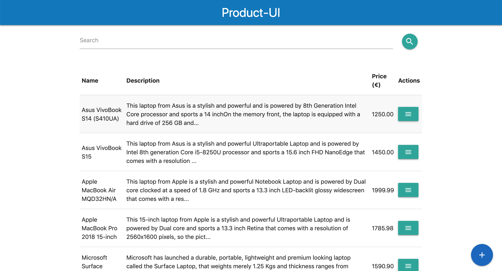
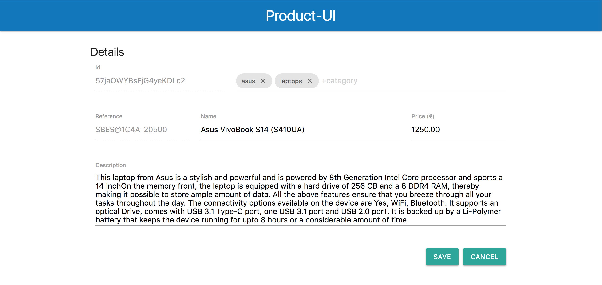
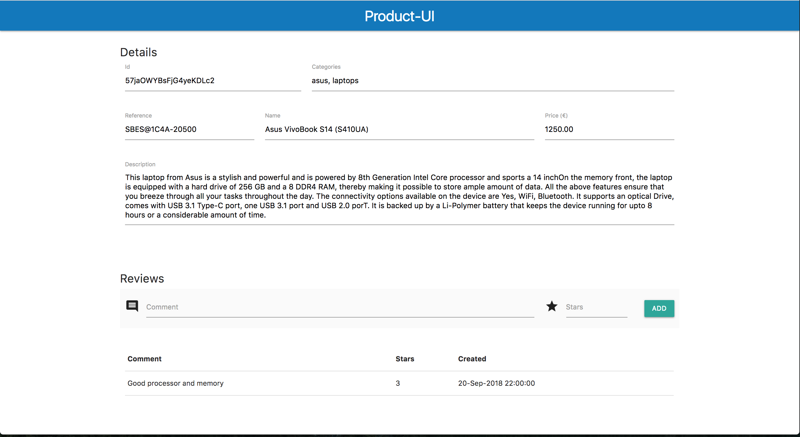

= `springboot-elasticsearch-thymeleaf`

The goal of this project is to implement two Spring-Boot applications: `product-api` and `product-ui`.
`product-api` is a Restful Web Service that manages products. It uses https://www.elastic.co[Elasticsearch] as storage.
`product-ui` is a client of `product-api`. It uses https://www.thymeleaf.org/[Thymeleaf] as HTML template.

== Start Environment

Open a terminal and inside `springboot-elasticsearch-thymeleaf` root folder run
```
docker-compose up -d
```

Wait a little bit until the docker containers are up and healthy. To check it, run
```
docker-compose ps
```

== Configure index, alias and insert some products in ES

- In a terminal and inside `springboot-elasticsearch-thymeleaf/scripts`, run the following script to create the
index `ecommerce_v1` with the alias `ecommerce`
```
./create-index.sh
```

- If you want to insert some products, run
```
./insert-products.sh
```

- If you want to fix the `reference` property mapping error (explained below), run
```
./reindex.sh
```

=== Reindex

The script `./reindex.sh` is used to reindex from an index to another index. The default will reindex from `ecommerce_v1`
to `ecommerce_v2`. The only difference between `mapping-v1.json` (used by `ecommerce_v1`) to `mapping-v2.json` (used by
`ecommerce_v2`) is the `type` of the `reference` property. In the former is set `text` and in the latter, `keyword`.

It is interesting because, the `reference` property has some special characters. An example of `reference` code is
`SBES@DDR4-10000`. As it is a `text`, ES (using the `standard` analyzer) splits the content in tokens ['SBES', 'DDR4',
10000]. So, for example, if you are looking for a product with `DDR4` RAM and, for some reason, the string `DDR4` is
present in the reference code of some product X, the product X will be selected, even if it doesn't have `DDR4` in its
description. It is an error.

So, the script `./reindex.sh` aims to fix it, setting the type `keyword` to `reference` property. The `DDR4` problem
won't happen again because, from now on, ES won't tokenize the content present in the `reference` property.

== Microservices

=== eureka-server

In a new terminal and inside `springboot-elasticsearch-thymeleaf` root folder, run the following command to start
`eureka-server`
```
./mvnw spring-boot:run --projects eureka-server
```

=== product-api

In a new terminal and inside `springboot-elasticsearch-thymeleaf` root folder, run the following command to start
`product-api`
```
./mvnw spring-boot:run --projects product-api
```

=== product-ui

In a new terminal and inside `springboot-elasticsearch-thymeleaf` root folder, run the following command to start
`product-ui`
```
./mvnw spring-boot:run --projects product-ui
```

== Microservices URLs

|===
|Microservice |URL

|`eureka-server`
|http://localhost:8761

|`product-api`
|http://localhost:8080/swagger-ui.html

|`product-ui`
|http://localhost:8081
|===


== Some screenshots of product-ui

Product list screen


Product edit screen


Product view/comment screen


== Elasticsearch REST API

- Alias: `ecommerce`
- Index: `ecommerce_v1`
- New Index: `ecommerce_v2`
- Type: `product`
- REST API Format: `http://host:port/index/type/_action-OR-id`

=== Check ES is up and running
```
curl http://localhost:9200
```

=== Create _ecommerce_v1_ index
```
curl -X PUT localhost:9200/ecommerce_v1 \
     -H "Content-Type: application/json" \
     -d '{ "mappings": { "product": { "properties": { "name": { "type": "text" }, ... }'
```

=== Check indexes in ES
```
curl http://localhost:9200/_cat/indices?v
```

=== Check _ecommerce_v1_ index mapping
```
curl http://localhost:9200/ecommerce_v1/_mapping
```

=== Delete _ecommerce_v1_ index
```
curl -X DELETE http://localhost:9200/ecommerce_v1
```

=== Create alias for _ecommerce_v1_ index
```
curl -X POST localhost:9200/_aliases \
     -H 'Content-Type: application/json' \
     -d '{ "actions": [{ "add": {"alias": "ecommerce", "index": "ecommerce_v1" }}]}'
```

=== Check existing ES alias
```
curl http://localhost:9200/_aliases
```

=== Reindex from _ecommerce_v1_ to _ecommerce_v2_
```
curl -X POST localhost:9200/_reindex \
     -H 'Content-Type: application/json' \
     -d '{ "source": { "index": "ecommerce_v1" }, "dest": { "index": "ecommerce_v2" }}'
```

=== Adjust alias after reindex from _ecommerce_v1_ to _ecommerce_v2_
```
curl -X POST localhost:9200/_aliases \
     -H 'Content-Type: application/json' \
     -d '{ "actions": [{ "remove": {"alias": "ecommerce", "index": "ecommerce_v1" }}, { "add": {"alias": "ecommerce", "index": "ecommerce_v2" }}]}'
```

=== Simple search
```
curl http://localhost:9200/ecommerce/product/_search
```

== Shutdown

Run the following command to stop and remove containers, networks and volumes
```
docker-compose down -v
```

== TODO

- add some Ajax calls, for example, when adding a comment, so the page doesn't need to be refreshed (https://grokonez.com/java-integration/integrate-jquery-ajax-post-get-spring-boot-web-service);
- add same nav bar to all pages & add home button;
- add pagination. now, it is just returning all products;
- add functionality to delete products;

== Reference

- https://www.baeldung.com/spring-cloud-netflix-eureka
- https://dzone.com/articles/microservice-architecture-with-spring-cloud-and-do
- https://www.digit.in/laptops-reviews