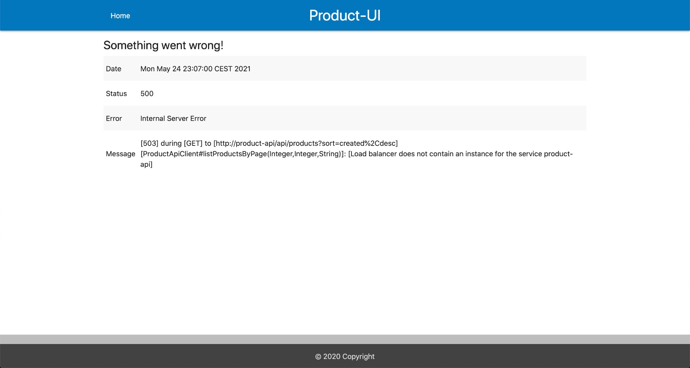

*= springboot-elasticsearch-thymeleaf*

The goal of this project is to implement an application called `product-app`. It consists of two https://docs.spring.io/spring-boot/docs/current/reference/htmlsingle/[`Spring Boot`] services: `product-api` (backend) and `product-ui` (frontend). Data will be stored in https://www.elastic.co/products/elasticsearch[`Elasticsearch`].

== Applications

* **product-api**
+
`Spring Boot` Web Java application that exposes a REST API to manages products. The information about products are stored in `Elasticsearch`. `product-api` uses https://docs.spring.io/spring-data/elasticsearch/docs/current/reference/html/[`Spring Data Elasticsearch`] to persist/query/delete data in https://www.elastic.co/products/elasticsearch[`Elasticsearch`]

* **product-ui**
+
`Spring Boot` Web application that was implemented using https://www.thymeleaf.org/[`Thymeleaf`] as HTML template. `product-ui` is a client of `product-api`. It uses https://cloud.spring.io/spring-cloud-static/spring-cloud-openfeign/current/reference/html/[`Spring Cloud OpenFeign`] to write web service clients easily.

* **eureka-server**
+
`Spring Boot` application, used as service discovery in this project

== Prerequisites

* https://www.oracle.com/java/technologies/downloads/#java17[`Java 17+`]
* https://www.docker.com/[`Docker`]
* https://docs.docker.com/compose/install/[`Docker-Compose`]

== Start Environment

* Open a terminal and navigate to `springboot-elasticsearch-thymeleaf` root folder run
+
[source]
----
docker-compose up -d
----

* Wait for `Elasticsearch` Docker container to be up and running. To check it, run
+
[source]
----
docker-compose ps
----

== Configure an index, alias and insert some products in ES

* In a terminal, make sure you are in `springboot-elasticsearch-thymeleaf` root folder

* Run the following script to create the index `ecommerce.products.v1` with the alias `ecommerce.products` (you can use the default values by just pressing `Enter` on every user input)
+
[source]
----
./create-index.sh
----

* If you want to insert some products, run
+
[source]
----
./insert-products.sh
----

* If you want to fix the `reference` property mapping error (explained below), run
+
[source]
----
./reindex.sh
----

=== Reindex

The script `./reindex.sh` is used to reindex an index to another. The default will reindex from `ecommerce.products.v1` to `ecommerce.products.v2`. The only difference between `elasticsearch/mapping-v1.json` (used by `ecommerce.products.v1`) to `elasticsearch/mapping-v2.json` (used by `ecommerce.products.v2`) is the `type` of the `reference` property. In the former, it is set the type `text` and, in the latter, the type `keyword`.

It's interesting because the `reference` property has some special characters. An example of `reference` code is `SBES@DDR4-10000`. As it has the type `text`, ES (using the `standard` analyzer) splits the content in tokens ['SBES', 'DDR4', 10000]. So, for example, if you are looking for a product with `DDR4` RAM and, for some reason, the string `DDR4` is present in the reference code of some product X, the product X will be selected, even if it doesn't have `DDR4` in its description.

So, the script `./reindex.sh` aims to fix it, setting the type `keyword` to the `reference` property. The `DDR4` search issue won't happen again because, from now on, ES won't tokenize the content present in the `reference` property.

== Running applications using Maven

Below are the steps to start and run the applications using `Maven`. We will need to open a terminal for each one. Make sure you are in `springboot-elasticsearch-thymeleaf` root folder while running the commands.

* **eureka-server**
+
[source]
----
./mvnw clean spring-boot:run --projects eureka-server
----

* **product-api**
+
[source]
----
./mvnw clean spring-boot:run --projects product-api -Dspring-boot.run.jvmArguments="-Dserver.port=9080"
----

* **product-ui**
+
[source]
----
./mvnw clean spring-boot:run --projects product-ui -Dspring-boot.run.jvmArguments="-Dserver.port=9081"
----

== Running applications as Docker containers

* Build Docker Images
** In a terminal, make sure you are in `springboot-elasticsearch-thymeleaf` root folder
** Run the following script
+
[source]
----
./docker-build.sh
----

* Environment Variables

** **product-api**
+
|===
|Environment Variable |Description

|`EUREKA_HOST`
|Specify host of the `Eureka` service discovery to use (default `localhost`)

|`EUREKA_PORT`
|Specify port of the `Eureka` service discovery to use (default `8761`)

|`ELASTICSEARCH_HOST`
|Specify host of the `Elasticsearch` search engine to use (default `localhost`)

|`ELASTICSEARCH_NODES_PORT`
|Specify nodes port of the `Elasticsearch` search engine to use (default `9300`)

|`ELASTICSEARCH_REST_PORT`
|Specify rest port of the `Elasticsearch` search engine to use (default `9200`)
|===

** **product-ui**
+
|===
|Environment Variable |Description

|`EUREKA_HOST`
|Specify host of the `Eureka` service discovery to use (default `localhost`)

|`EUREKA_PORT`
|Specify port of the `Eureka` service discovery to use (default `8761`)
|===

* Run Docker containers
** In a terminal, make sure you are in `springboot-elasticsearch-thymeleaf` root folder
** Run the following script
+
[source]
----
./start-apps.sh
----

== Application's URL

|===
|Application |URL

|eureka-server
|http://localhost:8761

|product-api
|http://localhost:9080/swagger-ui.html

|product-ui
|http://localhost:9081
|===

NOTE: when accessing `product-ui`, if you get the exception shown in the picture below, wait a bit.

== Demo

* Below is a simple demo that shows a user interacting with `product-ui`
+
image::documentation/demo-user-interaction.gif[]

== Shutdown

* To stop applications
** If they were started with `Maven`, go to `eureka-server`, `product-api` and `product-ui` terminals and press `Ctrl+C`
** If they were started as Docker containers, go to a terminal and, inside `springboot-elasticsearch-thymeleaf` root folder, run the script below
+
[source]
----
./stop-apps.sh
----
* To stop and remove docker-compose containers, network and volumes, go to a terminal and, inside `springboot-elasticsearch-thymeleaf` root folder, run the following command
+
[source]
----
docker-compose down -v
----

== Cleanup

To remove the Docker images created by this project, go to a terminal and, inside `springboot-elasticsearch-thymeleaf` root folder, run the script below
[source]
----
./remove-docker-images.sh
----

== Creating indexes and reindexing them using Elasticsearch REST API

In the following steps, we are going to, manually and using `Elasticsearch` REST API, create an index called `ecommerce.products.v1`, associate an alias called `ecommerce.products` for it and then reindex to another index called `ecommerce.products.v2`.

Make sure you have a clean `Elasticsearch` without the indexes and alias mentioned previously. Also, the following `curl` commands must be executed in `springboot-elasticsearch-thymeleaf` root folder.

* Check ES is up and running
+
[source]
----
curl localhost:9200
----
+
It should return something like
+
[source]
----
{
  "name" : "5f932864548a",
  "cluster_name" : "docker-cluster",
  "cluster_uuid" : "J8k8aa6eSkOHlgJSZPl8kA",
  "version" : {
    "number" : "7.17.6",
    "build_flavor" : "default",
    "build_type" : "docker",
    "build_hash" : "79878662c54c886ae89206c685d9f1051a9d6411",
    "build_date" : "2022-05-18T18:04:20.964345128Z",
    "build_snapshot" : false,
    "lucene_version" : "8.11.1",
    "minimum_wire_compatibility_version" : "6.8.0",
    "minimum_index_compatibility_version" : "6.0.0-beta1"
  },
  "tagline" : "You Know, for Search"
}
----

* Create `ecommerce.products.v1` index
+
[source]
----
curl -X PUT localhost:9200/ecommerce.products.v1 -H "Content-Type: application/json" -d @elasticsearch/mapping-v1.json
----
+
It should return
+
[source]
----
{"acknowledged":true,"shards_acknowledged":true,"index":"ecommerce.products.v1"}
----

* Check indexes
+
[source]
----
curl "localhost:9200/_cat/indices?v"
----
+
It should return something like
+
[source]
----
health status index                 uuid                   pri rep docs.count docs.deleted store.size pri.store.size
green  open   .geoip_databases      Ud5Jc_p1SZav1G5CPd6X6g   1   0         40            0     38.3mb         38.3mb
yellow open   ecommerce.products.v1 rmL6pbPMQyKroHl9_KXTVQ   1   1          0            0       226b           226b
----

* Check `ecommerce.products.v1` index mapping
+
[source]
----
curl "localhost:9200/ecommerce.products.v1/_mapping?pretty"
----
+
It should return
+
[source]
----
{
  "ecommerce.products.v1" : {
    "mappings" : {
      "properties" : {
        "categories" : {
          "type" : "keyword"
        },
        "created" : {
          "type" : "date",
          "format" : "strict_date_time_no_millis||yyyy-MM-dd'T'HH:mmZZ"
        },
        "description" : {
          "type" : "text",
          "analyzer" : "my_analyzer",
          "search_analyzer" : "my_search_analyzer"
        },
        "name" : {
          "type" : "text",
          "analyzer" : "my_analyzer",
          "search_analyzer" : "my_search_analyzer"
        },
        "price" : {
          "type" : "float"
        },
        "reference" : {
          "type" : "text"
        },
        "reviews" : {
          "properties" : {
            "comment" : {
              "type" : "text"
            },
            "created" : {
              "type" : "date",
              "format" : "strict_date_time_no_millis||yyyy-MM-dd'T'HH:mmZZ"
            },
            "stars" : {
              "type" : "short"
            }
          }
        }
      }
    }
  }
}
----

* Create alias for `ecommerce.products.v1` index
+
[source]
----
curl -X POST localhost:9200/_aliases -H 'Content-Type: application/json' \
    -d '{ "actions": [{ "add": {"alias": "ecommerce.products", "index": "ecommerce.products.v1" }}]}'
----
+
It should return
+
[source]
----
{"acknowledged":true}
----

* Check aliases
+
[source]
----
curl "localhost:9200/_aliases?pretty"
----
+
It should return
+
[source]
----
{
  "ecommerce.products.v1" : {
    "aliases" : {
      "ecommerce.products" : { }
    }
  }
}
----

* Create `ecommerce.products.v2` index
+
[source]
----
curl -X PUT localhost:9200/ecommerce.products.v2 -H "Content-Type: application/json" -d @elasticsearch/mapping-v2.json
----
+
It should return
+
[source]
----
{"acknowledged":true,"shards_acknowledged":true,"index":"ecommerce.products.v2"}
----
+
Checking indexes again
+
[source]
----
curl "localhost:9200/_cat/indices?v"
----
+
It should return something like
+
[source]
----
health status index                 uuid                   pri rep docs.count docs.deleted store.size pri.store.size
green  open   .geoip_databases      Ud5Jc_p1SZav1G5CPd6X6g   1   0         40            0     38.3mb         38.3mb
yellow open   ecommerce.products.v2 j9zvCjkbQM6ME-h2L5CxJA   1   1          0            0       226b           226b
yellow open   ecommerce.products.v1 rmL6pbPMQyKroHl9_KXTVQ   1   1          0            0       226b           226b
----

* Reindex from `ecommerce.products.v1` to `ecommerce.products.v2`
+
[source]
----
curl -X POST localhost:9200/_reindex -H 'Content-Type: application/json' \
     -d '{ "source": { "index": "ecommerce.products.v1" }, "dest": { "index": "ecommerce.products.v2" }}'
----
+
It should return something like
+
[source]
----
{"took":4,"timed_out":false,"total":0,"updated":0,"created":0,"deleted":0,"batches":0,"version_conflicts":0,"noops":0,"retries":{"bulk":0,"search":0},"throttled_millis":0,"requests_per_second":-1.0,"throttled_until_millis":0,"failures":[]}
----

* Adjust alias after reindex from `ecommerce.products.v1` to `ecommerce.products.v2`
+
[source]
----
curl -X POST localhost:9200/_aliases -H 'Content-Type: application/json' \
     -d '{ "actions": [{ "remove": {"alias": "ecommerce.products", "index": "ecommerce.products.v1" }}, { "add": {"alias": "ecommerce.products", "index": "ecommerce.products.v2" }}]}'
----
+
It should return
+
[source]
----
{"acknowledged":true}
----
+
Checking aliases again
+
[source]
----
curl "localhost:9200/_aliases?pretty"
----
+
It should return something like
+
[source]
----
{
  "ecommerce.products.v1" : {
    "aliases" : { }
  },
  "ecommerce.products.v2" : {
    "aliases" : {
      "ecommerce.products" : { }
    }
  }
}
----

* Delete `ecommerce.products.v1` index
+
[source]
----
curl -X DELETE localhost:9200/ecommerce.products.v1
----
+
It should return
+
[source]
----
{"acknowledged":true}
----
+
Checking aliases again
+
[source]
----
curl "localhost:9200/_aliases?pretty"
----
+
It should return
+
[source]
----
{
  "ecommerce.products.v2" : {
    "aliases" : {
      "ecommerce.products" : { }
    }
  }
}
----

* Simple search
+
[source]
----
curl "localhost:9200/ecommerce.products/_search?pretty"
----
+
It should return something like
+
[source]
----
{
  "took" : 5,
  "timed_out" : false,
  "_shards" : {
    "total" : 1,
    "successful" : 1,
    "skipped" : 0,
    "failed" : 0
  },
  "hits" : {
    "total" : {
      "value" : 0,
      "relation" : "eq"
    },
    "max_score" : null,
    "hits" : [ ]
  }
}
----
+
> As we don't have any products, the `hits` array field is empty

== TODO

* Add some Ajax calls, for example, when adding a comment, so the page doesn't need to be refreshed (https://grokonez.com/java-integration/integrate-jquery-ajax-post-get-spring-boot-web-service);
* Add pagination. Currently, it's returning all products;
* Add functionality to delete product;
